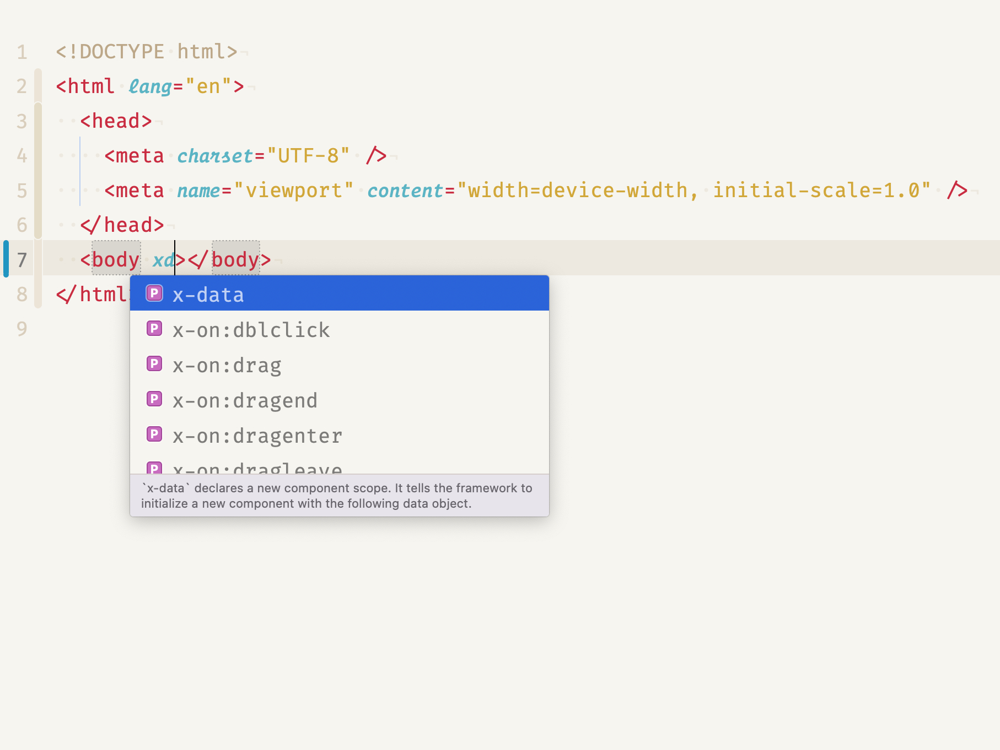

# AlpineJS Extension for Nova

## Introduction

This extension finally provides the long overdue **[AlpineJS](https://alpinejs.dev) Autocompletion** + **Snippets** to Nova Editor!

The **snippets** are extensible, so if you know any other handy snippets we could all benefit from, please feel free to fork the extension and edit the file located at (Definitions/Snippets/GeneralSnippets.js), edit and pull request? 😇

This extension has been inspired by [Jason Platts's **AMAZING** 💯 TailwindCSS Nova extension](https://github.com/jasonplatts/tailwindcss-nova-ext) and [Adrian Wilczyński's VSCode AlpineJS extension](https://github.com/AdrianWilczynski/AlpineIntelliSense), in fact most of the definitions in the current version are from there. Hopefully I could update the documentations to the AlpineJS v2 in the future updates  
**_Good luck with your projects!_** 🚀

<!-- add gif -->

## Usage

- The Attribute Autocompletion are triggered in the Tags.
- The Snippets are triggered only in the HTML body to avoid confusion and name resolution issues.

## Prerequisites

- The extension works in **_HTML, Blade, PHP_** if you are using AlpineJS in any other syntax [**please raise an issue**](https://github.com/EmranMR/AlpineJS-Nova-Extension/issues) on Github and I will add them as soon as possible.

## Requirements

- There are no requirements for the extension apart from having a Nova v3.0+  
  _just plug and play_ 🚀

## Report a Bug or Feature Request

Please use the [GitHub Repository](https://github.com/EmranMR/AlpineJSNova) for all requests. 😊

## To Do: 🥵

1. Adding modifiers support ☑️
2. Getting JS Syntax highlighting working in the attribute (would be a killer feature!) ☑️
3. Better Documentations ☑️
4. Allowing user configuration ☑️
5. Prob many Bugs 🐞 to fix and increase the efficiency? ☑️
